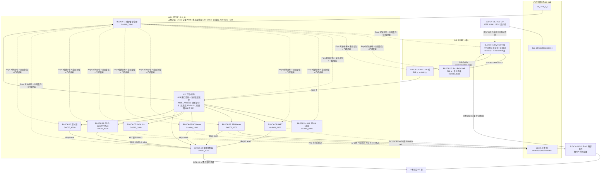

# 系统架构说明书 — tinyRISCV MCU 级 SoC

> 节点 B1 产物（系统架构）| 归属：arch-agent | 版本：v1.0（待 B5 架构评审冻结）
> 上位输入（spec-v1.0 冻结基线，只读）：spec-001（REQ 20）、spec-002（SC 12 / UC 32）、spec-004（FS 20 / PPAC 20 / BLOCK-01~14）、spec-005（总线 7 / 引脚 23 / 中断 10 / 存储 15）
> 已裁定决策（不得重议）：ADR-009（AXI4 统一外设总线，B3 可评估升级 AXI4 全量；引脚复用方案；启动时延 ≤100ms）、OI-A1-001/002（SPI Flash + AXI_SRAM 存储方案、自研 RIB↔AXI 桥接标准 AXI 外设）、OI-A3-006（PPAC-013 放宽至 ≤100ms，closed）
> 本文不涉及：地址分配细化（B2）、总线协议量化选型（B3）、面积/功耗建模（B4）。地址空间仅引用 spec-005 §7 初版作占位说明。

---

## 1. 架构概述与候选方案结论

### 1.1 架构形态

**分区桥接式单主架构**：tinyRISCV 核（BLOCK-01）为唯一总线主设备，经其私有 RIB 总线挂 Boot ROM（BLOCK-12）与 RIB↔AXI 桥（BLOCK-02）；桥将 RIB 事务转换为 AXI4 事务，驱动统一 AXI4 外设总线（ADR-009 决策 1：全量 AXI4；突发/outstanding/ID 宽度参数由 B3 量化细化；从侧接口分层分析见 §10），访问 AXI_SRAM 与 8 个外设寄存器窗口。从侧接口分层：结构 β 已由 B1 质量门人工裁定（ADR-025，见 §10）。

### 1.2 候选方案对比（详章要求 2~3 个，最终选型须人工裁定）

| 方案 | 描述 | 优点 | 缺点 | 量化/定性依据 |
|------|------|------|------|--------------|
| A：单主分区桥接式（推荐） | RIB 域（核+BootROM+桥）+ AXI4 域（SRAM+8 外设），单主无仲裁 | 结构最小、面积最小、时序路径短 | 无并发主，峰值带宽受核限制 | 唯一主=核；外设峰值需求 ≪ 总线能力（spec-005 §2.3：SPI 12.5Mbps ≪ 200MB/s）；PPAC-015 面积预算 ≤50k 门要求结构最简 |
| B：多主全 AXI 化 | 核直接 AXI4 主 + DMA/JTAG 皆为主，全互联 | 带宽扩展性好 | 面积/仲裁复杂度上升，tinyRISCV 仅提供 RIB 接口，需全量桥；无 DMA 需求（REQ 清单无 DMA） | REQ 20 条中无 DMA/多主需求；核接口契约束缚（C0 待验证） |
| C：中心式单总线（RIB 直挂全部外设） | 全部外设做 RIB 从 | 无桥、时延最低 | 需为 8 个外设各自实现 RIB 私有协议从接口，与"标准 AXI 外设"复用策略冲突（OI-A1-002 已裁定标准 AXI） | OI-A1-002 裁定自研桥 + 标准 AXI 外设；复用生态（axi_uart 等）要求 AXI 接口 |

**结论**：采用方案 A。理由：①与已裁定 ADR-009 / OI-A1-001/002 一致；②REQ 无多主/DMA 需求，B/C 的扩展性收益为零成本浪费；③PPAC-015 面积预算与 PPAC-014 时延预算（≤10 周期）在单主结构下最易满足。**方案 A 已由 B1 质量门人工裁定采纳（ADR-025，含从侧结构 β）。**

---

## 2. 顶层框图



> **地址空间占位说明（B2 细化）**：地址区仅引用 spec-005 §7 初版（RIB 侧 Boot ROM @0x0000_0000 / AXI 侧 SRAM @0x2000_0000 / 外设窗口 @0x4000_0000~0x4000_7FFF 每 4KB）；Boot ROM 4KB 容量与 SRAM 64KB 容量的量化确认归 B2。

---

## 3. 模块划分与职责边界

> 完整机器可读清单见配套 `arch-008-module-list.csv`。架构角色分类：主（bus master）/ 从（bus slave）/ 桥（protocol bridge）/ 存储（memory）/ 模拟&时钟复位源（CRG）/ 外部器件（off-chip）/ 非总线控制块。

| BLOCK | 模块 | 架构角色 | 总线域 | 职责边界（做什么/不做什么） | 来源候选（B6 裁定） |
|-------|------|---------|--------|---------------------------|-------------------|
| 01 | tinyRISCV 核 | 唯一总线主 | RIB | RV32IM 取指/执行/访存；接收中断请求（契约待 C0） | 复用 IP（Apache-2.0，版本 C0 pin） |
| 02 | RIB↔AXI 桥 | 桥（RIB 从 + AXI4 主） | 跨域 | RIB↔AXI 事务转换、译码转发（addr≥0x2000_0000）、访问错误返回；不做缓存/重排/多 outstanding（深度 B3 定） | 自研 SoC 级 IP |
| 03 | UART | AXI 从 | AXI | 双向收发/FIFO/波特率分频/中断；不做 RS-232 电平（板级） | 复用/自研（B6/C0） |
| 04 | JTAG | 非总线控制块（TAP） | 无（异步 TCK 域） | IEEE 1149.1 TAP、IDCODE；调试访问机制待 C0 评估（无标准 DM） | 复用/自研（B6/C0） |
| 05 | SPI Master | AXI 从 + 外部总线主（SPI） | AXI | SPI 四模式/SCLK 分频 ≤Fsys/4/CS 控制/Flash 命令通道；不做 Flash 协议状态机（固件级，BLOCK-12） | 自研 |
| 06 | IIC Master | AXI 从 + 外部总线主（I²C） | AXI | 7-bit 寻址/100k/400k/NACK 检测 | 自研 |
| 07 | PWM | AXI 从 | AXI | 2 通道 8bit 周期/占空比、0%/100% 边界 | 自研 |
| 08 | GPIO | AXI 从 + 引脚复用器 | AXI | 16 路 IO/方向/PINMUX/-pad 配置/GPIO 事件中断（AF0 时有效） | 自研 |
| 09 | 中断控制器 | AXI 从 + 中断聚合 | AXI | 10 源使能/屏蔽/挂起/清除/优先级/向量输出 | 自研 |
| 10 | 定时器 | AXI 从 + 中断源 | AXI | 可编程周期定时、±1 周期精度 | tinyRISCV 自带或自研（B6/C0） |
| 11 | 时钟复位管理（CRG） | 时钟复位源 + AXI 从 | AXI | Fsys 分频（10–50MHz）、POR/外部复位异步置位同步释放、L2 软复位、时钟门控 | 自研 |
| 12 | Boot ROM | RIB 从 + 存储（固件级逻辑） | RIB | 4KB bootloader：SPI Flash 读 → SRAM 加载 → 跳转；UART 固件更新协议 | 自研（固件级） |
| 13 | SPI Flash | 外部器件（经 BLOCK-05 PIO 访问） | — | 非易失固件存储；无地址映射 | 板级器件 |
| 14 | AXI_SRAM | AXI 从 + 存储 | AXI | 64KB 运行数据/固件加载目标（容量 B2 量化） | 自研存储 |

另含 **AXI 互联/译码**（IB，非独立 BLOCK）：4KB 窗口译码 + 保留区访问错误返回，归属 BLOCK-02 桥实现或独立 glue——**架构留待 B3 裁定**（推荐并入 BLOCK-02，避免孤儿逻辑）。

**一致性核对**：框图节点 14 + IB = 模块清单 14 + 1 glue；无孤儿模块（全部 14 BLOCK 有总线/中断/引脚至少一条连接）；无重复功能（PINMUX 唯一归 BLOCK-08，时钟门控唯一归 BLOCK-11）。

---

## 4. 关键数据流定义

### 4.1 流① 启动取指流（FS-001，PPAC-013 ≤100ms）

```
复位释放(POR/rst_n_i, BLOCK-11 L1 异步置位同步释放)
 → 核(BLOCK-01) 从 0x0000_0000 取指 (RIB-INST → BLOCK-12 Boot ROM)
 → bootloader 初始化: 配置 SPI(BLOCK-05, MEM-06) SCLK=Fsys/4=12.5MHz, CS0
 → 循环: SPI PIO 读 Flash 命令 → BLOCK-13 回数据 (pad: gpio[6:3] AF1)
 → 每字经 RIB-DATA → 桥(BLOCK-02) → AXI → AXI_SRAM(BLOCK-14 @0x2000_0000)
 → CRC/校验 → 跳转 0x2000_0000 执行固件首指令
```

**时延预算（@50MHz，64KB 镜像）**：复位释放+BootROM 自身执行 ≈ 1ms 量级；SPI 传输主导：单线 12.5MHz，64KB×8bit/12.5Mbps ≈ 41.9ms（满速），按 70% 有效带宽评估 ≈ 60ms；SRAM 写经桥（每次 ≤10 周期，PPAC-014）与 SPI 字节流交叠可忽略。**合计 ≈ 61ms < 100ms ✓（OI-A3-006 已关闭口径）**。风险：bootloader 若逐字节轮询效率低于 70%——B4 建模复核（RMP 候选：SPI FIFO + 突发读优化）。

### 4.2 流② 核经桥访存流（FS-016，PPAC-014 ≤10 周期）

```
核发 RIB-DATA 读/写 (addr ≥ 0x2000_0000)
 → 桥从端口接收 (RIB req, ~1 周期)
 → RIB→AXI 转换 + AXI 地址/写通道发出 (~1-2 周期)
 → AXI 译码(IB) 路由 (~1 周期)
 → 目标从响应: SRAM 单拍读 1-2 周期 / 外设寄存器 1 周期
 → AXI R/B 通道返回 + AXI→RIB 转换 (~1-2 周期)
 → RIB resp 返回核
```

**预算分配（读路径合计 ≤10 周期）**：RIB 从接收 1 + 转换发 AXI 2 + 译码 1 + SRAM 2 + 返回转换 2 + 裕量 2 = 10 ✓。约束：桥不做多 outstanding、单 ID（spec-005 §2.2 #5），突发深度 B3 细化；保留区访问（MEM-02/04/13/15）由桥返回总线错误（DECERR/SLVERR），FS-016"无总线错误"指合法地址数据一致，非法地址须报错不挂死。

### 4.3 流③ 中断流（FS-008，PPAC-011 ≤30 周期）

```
事件源: 外部 GPIO 边沿(BLOCK-08, 仅 AF0) / UART(BLOCK-03) / SPI(BLOCK-05)
        / IIC(BLOCK-06) / 定时器(BLOCK-10) / 软件置位(BLOCK-09)
 → IRQ1..10 进入中断控制器(BLOCK-09): 挂起寄存器置位 (1 周期)
 → 屏蔽/使能过滤 + 优先级仲裁 (1-2 周期)
 → 聚合中断请求 + 向量号输出 → 核中断端口 (契约待 C0)
 → 核流水线冲刷 + 保存现场 + CSR(mstatus/mepc) 更新
 → 取 ISR 首指令 (经 RIB-INST, 若 ISR 在 SRAM 需经桥)
```

**预算分配（事件置起 → ISR 首指令执行，合计 ≤30 周期）**：INTC 置位+仲裁 ≤3 + 核中断入口（3 级流水冲刷 + CSR 写，tinyRISCV 契约，估 ≤10，**待 C0 验证**）+ ISR 取指 ≤10（Boot ROM/ITCM 内则更短；SRAM 内经桥单次 ≤10）+ 裕量 7 ✓。ISR 向量表位置（SRAM vs Boot ROM）影响预算下限——**B4 建模项**。

### 4.4 数据流矩阵（场景覆盖，12 SC → 通路）

| SC | 场景 | 通路（主→…→从） | 关键指标 |
|----|------|----------------|---------|
| SC-01 启动 | 流①（§4.1） | PPAC-013/001/002 |
| SC-02 UART | 核↔桥↔UART↔pad | PPAC-004/005 |
| SC-03 固件更新 | UART→SRAM→SPI→Flash（流①逆向变体） | PPAC-013 |
| SC-04 JTAG | TAP→（调试通路，待 C0）→总线 | — |
| SC-05 SPI | 核↔桥↔SPI↔外部从设备 | PPAC-006/007 |
| SC-06 IIC | 核↔桥↔IIC↔外部从设备 | PPAC-008 |
| SC-07 PWM | 核↔桥↔PWM→pad | PPAC-009/010 |
| SC-08 中断 | 流③（§4.3） | PPAC-011/012/019 |
| SC-09 低功耗 | 事件→INTC→CRG 唤醒/门控解除 | PPAC-016/017/018 |
| SC-10 总线 | 流②（§4.2） | PPAC-014 |
| SC-11 GPIO | 核↔桥↔GPIO↔pad；事件→流③ | PPAC-020 |
| SC-12 验收演示 | SC-02/05/06/07/11 组合 | FS-018 |

**覆盖：12/12 SC、32/32 UC（经 spec-005 §8 UC→接口映射 + 本文通路）✓**

---

## 5. 时钟域与复位架构

### 5.1 时钟域（单域 + 2 个边界）

| 时钟 | 域 | 说明 |
|------|-----|------|
| Fsys 50MHz（10–50 可配） | **唯一内部功能时钟域** | clk_i 经 BLOCK-11 分频生成；全部 BLOCK 同步设计；UART/SPI/IIC/PWM 分频时钟不构成独立域 |
| JTAG TCK | 外部异步输入域 | **CDC 点 #1**：TCK 域→Fsys 域，TAP 输出（调试访问数据/控制）经 2FF 同步器；TDO 输出侧 TCK 域再同步（方向与深度 C5 检查） |
| SPI SCLK | 输出到外部（Fsys 域内生成） | 非独立域；MISO 输入按 SPI 从设备时序在 Fsys 域采样（**CDC 边界 #2：外部异步输入，半周期采样策略 C1/C5 细化**） |

**C5 CDC 检查清单（本架构产出）**：① TCK→Fsys 同步器存在性与深度；② TDO Fsys→TCK 输出同步；③ SPI/IIC/UART pad 异步输入采样策略（毛刺滤波/同步器）；④ GPIO 输入（外部异步）→中断检测边沿同步。全同步单域设计，无内部多域。

### 5.2 复位架构（3 级，沿 spec-005 §5.2）

```
POR + rst_n_i（异步）
 → BLOCK-11 复位同步器（异步置位、同步释放到 Fsys 域）
    ├─ L1 全局复位 → 全部 BLOCK（含 BLOCK-01 核，复位向量 0x0000_0000）
    ├─ L3 核复位 = L1 派生（同相释放）
    └─ L2 外设软复位（SOFT_RST 寄存器，逐外设 BLOCK-03~10，自动清除）
JTAG trst_n（可选）→ 仅 BLOCK-04 TAP 域
```

复位后已知状态：PINMUX=AF0（全部 GPIO 输入+上拉）、CLK_EN 默认值、中断全屏蔽、核 PC=0x0000_0000（FS-010）。

---

## 6. 架构级风险清单

| # | 风险 | 影响 | 等级 | 缓解/归属 |
|---|------|------|------|----------|
| R1 | tinyRISCV 中断入口时延 >10 周期预算（无标准中断契约文档，C0 未验证） | PPAC-011 ≤30 可能失守 | 高 | C0 合同验证前置；备选：向量表放 Boot ROM 缩短取指；B4 建模 |
| R2 | JTAG 无标准 Debug Module，openocd 内存访问机制未定 | FS-004 实现方案悬空 | 高 | C0 评估；备选：TAP 直挂总线（自制 DM-lite），架构已在框图预留调试通路 |
| R3 | RIB 协议契约（req/resp 时序）未文档化，桥设计输入不稳 | BLOCK-02 返工 | 高 | C0 前置验证；桥时延预算已留裕量 2 周期 |
| R4 | bootloader 逐字节轮询 SPI 导致有效带宽 <70%，启动超 100ms | PPAC-013 | 中 | B4 建模复核；优化项（SPI FIFO/块读）登记 roadmap 候选 |
| R5 | Boot ROM 4KB 容量不足（bootloader + 向量表 + 更新协议） | MEM-01 需扩 | 中 | B2 量化（代码尺寸估算） |
| R6 | AXI 互联归属（桥内 vs 独立 glue）未定 | 模块边界漂移 | 低 | B3 裁定（推荐并入 BLOCK-02） |
| R7 | AXI4 全量（ADR-009 裁定）下突发/outstanding/ID 宽度参数与 PPAC-014 时延的平衡 | 桥与从接口参数返工 | 低 | B3 量化细化；从侧接口分层 β 已裁定（ADR-025，§10），转换器归属仍待 B3（R6） |
| R8 | 空闲门控唤醒路径（INTC→CRG→时钟恢复）≤10μs 未逐级分解 | PPAC-018 | 中 | B4 建模；架构上唤醒源均落在 Fsys 域内、无域跨越，仅门控恢复延迟 |

## 7. 待 B2/B3 细化项交接

- **→ B2**：Boot ROM 容量确认（R5）、AXI_SRAM 64KB 确认、中断向量表位置、全部地址区正式化（本图仅占位引用 spec-005 §7）。
- **→ B3**：AXI4 突发/outstanding/ID 宽度量化（R7）、桥 outstanding/突发深度、从侧 AXI4→AXI4-Lite 转换器归属确认（§10，结构 β 已裁定 ADR-025，转换器归属仍留 B3）、互联归属（R6）、RIB 侧时序参数（依赖 C0）、访问错误响应类型（DECERR/SLVERR）统一定义。

## 8. Measure 度量汇总

| 度量 | 值 |
|------|-----|
| 框图 BLOCK 覆盖 | 14/14（+1 AXI 互联 glue） |
| 总线域 | 2（RIB / AXI4）；主端口 2（RIB-INST/DATA）、AXI 从端口 9（SRAM+8 外设，从侧分层 β 已裁定 ADR-025 §10） |
| 数据流关键路径 | 3 条展开（启动/访存/中断）+ 场景矩阵 12 SC（32 UC 经引用覆盖） |
| 中断通路 | 10 源 → 1 聚合 → 核 |
| CDC 点 | 4（TCK 输入、TDO 输出、串行 pad 输入采样、GPIO 输入） |
| 时钟域 | 1 内部 + 1 外部异步（TCK） |
| 风险项 | 8（高 3 / 中 3 / 低 2） |
| 候选方案 | 3（A 已裁定采纳，ADR-025） |

## 9. DoD 自检（Judge）

| DoD 判据 | 自检 | 结论 |
|----------|------|------|
| 全部 REQ/FS 有架构承接 | REQ 20→FS 20→BLOCK 映射沿用 spec-004 §2.2/§7；FS-014/018/019（全系统/约束类）由整体架构承接 | ✅ |
| 模块划分无孤儿/无重复 | 14 BLOCK 全部有连接路径；PINMUX/门控等功能归属唯一（§3 核对） | ✅ |
| 数据流覆盖 100% | 12/12 SC、32/32 UC（§4.4 + spec-005 §8 引用） | ✅ |
| 关键路径时延预算可行 | 流① 61ms<100ms ✓；流② 分解=10 周期 ✓；流③ 分解 ≤30（核入口待 C0，R1 跟踪） | ✅（附风险跟踪） |
| 一致性：框图↔模块清单↔端口计数 | 框图节点=清单 14+IB；主 2/从 9+RIB 从 2 与 spec-005 §2.2 七条总线条目对应 | ✅ |
| 候选方案与选型依据 | 3 方案量化对比（§1.2），方案 A + 从侧结构 β 已由质量门人工裁定（ADR-025） | ✅（ADR-025） |
| open issue/风险有结论 | 8 风险均有缓解与归属 | ✅ |

**结论：B1 DoD 自检通过；质量门已人工裁定（ADR-025）：方案 A + 外设桥接结构 β。可进入 B2；架构整体冻结仍待 B5。**

---

## 10. AXI4 全量下外设接口桥接层级分析

> 背景：ADR-009 决策 1 裁定总线统一 **AMBA AXI4（全量）**（桥 AXI 侧、AXI_SRAM、全部外设从端口统一 AXI4；突发/outstanding/ID 宽度由 B3 量化细化）。本节回答质量门提出的问题：RIB↔AXI4 全量桥之后，各外设从端口的接口形态，以及是否需要 AXI4→AXI4-Lite 二级转换。**结构 α/β 已经 B1 质量门人工裁定：采用结构 β（ADR-025）——SRAM 走 AXI4 全量 + 8 寄存器外设经 AXI_IB 内 AXI4→AXI4-Lite 转换器降 Lite；结构 α 已否决。**

### 10.1 逐外设访问特征与推荐从端口协议

| BLOCK | 外设 | 访问特征 | 典型流量 | 时延敏感度 | 推荐从端口 | 理由 |
|-------|------|---------|---------|-----------|-----------|------|
| 14 | AXI_SRAM 64KB | **有突发需求**：固件加载（流① 64KB 顺序写）、运行数据/栈/数据段搬移 | 高（唯一高流量从机：加载期 64KB，运行期取数/访存） | 中（PPAC-014 ≤10 周期，但主要瓶颈在桥不在从机） | **AXI4（全量）** | 突发传输可将每字节省的地址/握手开销摊薄，支撑 PPAC-013 固件加载带宽与运行数据吞吐；若降为 Lite，64KB 加载退化为 64K 次单拍，地址通道流量翻倍、启动时延恶化（R4 风险放大） |
| 03 | UART | 单拍寄存器 R/W（THR/RHR/LSR 轮询），数据经内部 FIFO | 低（≤115.2kbps 线速，寄存器访问稀疏） | 中（轮询 LSR 时延影响吞吐，但周期量级余量大） | AXI4-Lite | 纯寄存器窗口，无突发语义需求；Lite 从机省去 AR[A]LEN/AWSIZE/BURST/CACHE/ID/last 等 5 通道全量握手逻辑 |
| 05 | SPI Master | 单拍寄存器 R/W（PIO 命令/数据/FIFO），加载期轮询密集 | 中（启动加载期轮询密集，但单次仍为 1 拍） | 中（轮询效率影响 PPAC-013，见 R4） | AXI4-Lite | 同上；轮询密集是访问频率问题，非突发问题，Lite 单拍语义完全覆盖 |
| 06 | IIC Master | 单拍寄存器 R/W（100k/400kbps 慢速外设） | 低 | 低 | AXI4-Lite | 无突发、无带宽压力 |
| 07 | PWM 2ch | 单拍配置寄存器（周期/占空比），运行期零访问 | 极低 | 低（配置非实时关键） | AXI4-Lite | 静态配置型接口 |
| 08 | GPIO/PINMUX | 单拍 R/W（方向/复用/输入采样），事件走中断线不走总线 | 低 | 低 | AXI4-Lite | 配置型 + 状态读取，单拍足够 |
| 09 | 中断控制器 | 单拍 R/W（使能/屏蔽/挂起/清除/向量读） | 低但**时延敏感**（ISR 入口读向量/清挂起在 PPAC-011 ≤30 周期路径上） | 高 | AXI4-Lite | 无突发需求；时延由从机 1 拍响应保证（§4.3 预算已含），与协议全量与否无关 |
| 10 | 定时器 | 单拍 R/W（配置/计数读/清除） | 低 | 中（计数读希望低抖动） | AXI4-Lite | 配置型接口 |
| 11 | CRG（时钟复位管理） | 单拍 R/W（分频/门控/软复位），含 L2 软复位自清除 | 极低 | 低 | AXI4-Lite | 配置型接口；注意软复位写路径需在复位前完成握手（C1 细化） |

**小结**：唯一有真实突发/带宽需求的是 BLOCK-14 AXI_SRAM（PPAC-013 加载 64KB + 运行数据带宽）；8 个寄存器外设全部为单拍寄存器窗口访问，Lite 语义完备覆盖，且其中 INTC（BLOCK-09）时延敏感但敏感性源于从机响应速度而非协议宽度。

### 10.2 结构 α 与结构 β 对比

| 维度 | 结构 α：全部从端口直接 AXI4 全量（**已否决**） | 结构 β：AXI_SRAM 走 AXI4 + 寄存器外设经 AXI4→AXI4-Lite 转换器（**β 已裁定，ADR-025**） |
|------|--------------------------------|------------------------------------------------------------|
| 概念 | 每外设实现 5 通道（AW/W/B/AR/R）完整 AXI4 从机，含 ARLEN/AWLEN 突发响应、outstanding 记账、ID 匹配 | 桥/互联后分两支：SRAM 分支保留 AXI4 全量；寄存器空间分支经 AXI4→AXI4-Lite glue（单拍化：强制 LEN=0、ID 单一化、禁写响应交错需 glue 串行化）降为 Lite 从端口 |
| 面积（对照 PPAC-015 ≤50k 门） | 每个全量从机较 Lite 从机多出突发计数/ID 通道/last 生成等逻辑，业界经验约 +0.3~0.8k 门/外设 ×8 ≈ +2.4~6.4k 门，互联 AWID/ARID 位宽全宽铺设 | 转换器为纯 glue（无缓冲、单 outstanding 串行即可满足寄存器访问），估 0.5~1.5k 门；8 个 Lite 从机省出上述 2.4~6.4k 门。**净省约 2~5k 门**，两者均在 50k 门预算内但 β 裕量更大 | 
| 时延（对照 PPAC-014 ≤10 周期） | 无转换级，寄存器访问路径与 §4.2 预算一致 | 转换器插入 ≤1 周期（地址透传 + 单拍化判断可组合/1 拍完成）。§4.2 预算裕量 2 周期可吸收 → 仍 ≤10 ✓。**对 SRAM 分支零影响**（不经转换器） |
| 验证复杂度 | 9 个从机全部需 AXI4 全量 agent（burst/out-of-order/ID 交叉用例），每外设 TB 需突发响应 scoreboard；D1 测试空间显著扩大 | 8 个 Lite 从机验证面收窄为单拍读/写/等待/错误响应四类语义；AXI4 全量语义集中在 SRAM 分支 + 转换器一处（转换器需定向验证：突发进入寄存器区的行为——直接报错或拆拍，**B3/C2 定义**）。全量协议验证收敛点集中 |
| C1/C2 实现工作量 | 8 个自研外设每个都写全量 5 通道 + 突发解码，C2 契约每外设均含 AR/AW 通道全字段 | 自研外设从端口模板化为 Lite 3+2 通道（AW/W+B/AR+R 无 ID 无突发），C2 契约字段集大幅缩小；新增唯一一个转换器 glue 的契约 |

### 10.3 推荐与裁定项

**推荐结构 β——已由质量门人工裁定采纳（ADR-025）**。依据：①面积净省 2~5k 门且验证收敛点集中，与 PPAC-015/本实验"收敛优先"目标一致；②时延代价 ≤1 周期，被 §4.2 裕量覆盖，SRAM 突发能力（PPAC-013 关键路径）完整保留；③8 个寄存器外设中无一需要突发/outstanding 语义（§10.1），α 为"协议一致性洁癖"付出的面积/验证成本无需求支撑。

裁定为 β（ADR-025），明确以下三点：

1. **转换器归属**：推荐作为 **AXI 互联（IB）的从侧 glue**，与 R6"互联归属"一并由 B3 最终裁定（若 B3 裁定 IB 并入 BLOCK-02，则转换器随 IB 并入 BLOCK-02；不推荐新设 BLOCK-15——一个单 outstanding、无缓冲的 glue 不构成独立收敛单元，独立 BLOCK 反而违反"无孤儿逻辑"的最简边界原则）。
2. **对方案 A 的结构定性**：**不影响**。"单主分区桥接"的定性要素是"RIB 域 + AXI 域 + 唯一主 + 无仲裁"，β 仅改变 AXI 域**从侧**的协议分层（全量/Lite），不引入新主、不引入仲裁、不改桥的主侧契约。ADR-009"统一 AXI4"的裁定语义在**主侧/互联/编址层面保持全量 AXI4**，Lite 仅是从机实现子集——与 AMBA 规范中"AXI4 主机可访问 Lite 从机经适配"的分层思想一致。
3. **质量门裁定结果（ADR-025）**：结构 α/β 已裁定采用 **β**；α 已否决。"寄存器区突发访问"处理策略（直接 SLVERR 报错 vs glue 内拆拍）**仍待 B3/C2 定义**（非本裁定范围）。结果已回写本文 §1/§2/§3/§6/§7/§8/§9 并同步 CSV 与 B3 交接项。

### 10.4 业界惯例参照

业界 Cortex-M 类 SoC 的 AHB/APB 分层是同一思想：高速数据通路（SRAM/Flash 接口）挂 AHB 级总线保留突发能力，寄存器外设经 AHB-to-APB 桥降为 APB 的简单单拍语义，以最小化外设接口复杂度与验证面。结构 β 中 "AXI4 全量（数据存储）+ AXI4→Lite（寄存器外设）" 与之同构，是 AXI 世代 SoC 的常见做法（如 Zynq/部分 RISC-V MCU 的 GP/HP 端口分层）。本芯片不引入超出此范围的复杂度：不做 AXI→AHB/APB 再层叠、不做多级转换、转换器保持单 outstanding 无缓冲 glue。

## 11. 变更记录

| 版本 | 日期 | 变更 | 作者 |
|------|------|------|------|
| v1.0 | 2026-08-21 | 初稿：候选方案 3 个、顶层框图、14 模块划分、3 条关键数据流、时钟复位架构、风险 8 项、B2/B3 交接项 | arch-agent |
| v1.1 | 2026-08-21 | 勘误（ADR-024）：全文 9 处 "AXI4-Lite" 误写更正为 "AXI4"（§1 摘要、§1.2 方案对比、§2 框图 AXI_DOMAIN/BRIDGE 标签与连线、§3 BLOCK-02 行、§6 R7、§7 B3 交接、§8 度量），对齐 ADR-009 决策 1（AXI4 全量）与 spec-005 §2.2 冻结口径；R7 与 B3 交接项同步改写。根因：orchestrator 任务书输入转述错误，非上游规格变更，冻结基线不受影响 | arch-agent |
| v1.1 | 2026-08-21 | 新增 §10 "AXI4 全量下外设接口桥接层级分析"（质量门提问响应）：逐外设访问特征表、结构 α/β 四维对比（面积/时延/验证/工作量）、推荐结构 β 及三点明确（转换器归 IB glue、不影响方案 A 定性、α/β 提请质量门裁定）、业界惯例参照；框图 AXI_DOMAIN 增从侧分层标注 | arch-agent |
| v1.1 | 2026-08-21 | CSV 同步勘误：`arch-008-module-list.csv` 补齐 v1.1 ADR-024 勘误与 §10 分析的同步（上次勘误遗漏 CSV）——BLOCK-02 `AXI4-Lite 主`→`AXI4 主`；BLOCK-14 `AXI4-Lite 从`→`AXI4 从（保留突发，§10 β 结构；α/β 待 B1 质量门裁定）`；BLOCK-03/05/06/07/08/09/10/11 八外设 Lite 从端口补注"β 结构下经 AXI4→Lite 转换；待裁定"；AXI_IB_glue 行补 AXI4→AXI4-Lite 转换（β 结构，归属随 R6 B3 裁定）。md 与 CSV 逐 BLOCK 复核（角色/协议/性能）一致 | arch-agent |
| v1.2 | 2026-08-21 | 质量门裁定落定（ADR-025）：**方案 A + 外设桥接结构 β**（SRAM AXI4 全量 + 8 寄存器外设经 AXI_IB 内 AXI4→AXI4-Lite 转换器降 Lite），α 标注已否决。§10 对比表 β 列标注已裁定、α 列标注已否决；框图 AXI_DOMAIN 从侧分层改"β（已裁定 ADR-025）"；§1.1/§1.2/§6 R7/§7 B3 交接/§8 度量/§9 DoD 中"待裁定"表述全部改为已裁定；转换器归属仍留 B3（R6），寄存器区突发访问处理策略仍待 B3/C2 定义；CSV 同步更新 | arch-agent |
