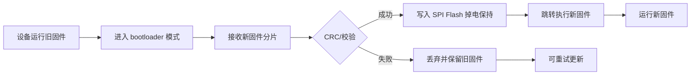

# 使用场景与用例清单（A1 产物）

> 节点 A1 产物 | 归属：spec-agent | 版本：v0.3
> 配套文档：`PRD.md`（需求）、`open-issues.md`（未决问题，v0.2 已全部关闭）
> 结构：SC（场景清单）→ UC（用例清单，按功能域归组，正常/边界/异常）→ 覆盖矩阵 → 度量
> v0.3 变更：UC 编号二级化 `UC-<功能域>-NNN`（11 功能域，与 PRD REQ 功能域对应）；全量 UC 引用/矩阵/度量同步；REQ→UC 矩阵修正 REQ-002 冗余引用
> v0.2 变更：OI-A1-001~005 关闭折入——新增 SC-10/11/12 与 UC-027~032（Flash 启动、固件更新写 Flash、RIB↔AXI 桥外设访问、GPIO、验收演示）

## 1. 场景清单（SC）

| SC | 场景名称 | 描述（运行条件/数据流） | 涉及模块 | 关联 REQ | 派生用例 |
|----|---------|------------------------|---------|---------|---------|
| SC-01 | 固件开发与部署 | 开发者在主机侧用 RISC-V 工具链编译固件，经加载通道写入目标并运行；**固件存储于 SPI Flash，复位后经 SPI 加载启动** | 核、SPI Flash、AXI_SRAM、加载通道 | REQ-001, REQ-011, REQ-017, REQ-013, REQ-018 | UC-BOOT-001, UC-BOOT-002, UC-BOOT-003, UC-BOOT-004 |
| SC-02 | 串口日志与命令交互 | 设备运行中经 UART 输出日志；主机经 UART 下发命令，设备响应 | UART、核、中断 | REQ-002 | UC-UART-001, UC-UART-002, UC-UART-003 |
| SC-03 | 固件在线更新 | 设备在用户现场经 UART bootloader 更新应用固件，**新固件写入 SPI Flash（掉电保持）**，要求失败可恢复 | UART、bootloader、SPI Flash | REQ-002, REQ-003, REQ-011 | UC-UART-004, UC-UART-005, UC-UART-006, UC-UART-007 |
| SC-04 | 调试与故障定位 | 工程师经 JTAG + openocd 读写内存/寄存器，定位软件或硬件故障（无标准 Debug Module 的影响待 C0 评估） | JTAG、核、总线 | REQ-004 | UC-JTAG-001, UC-JTAG-002, UC-JTAG-003 |
| SC-05 | SPI 外设扩展 | MCU 作 SPI master 控制外部从设备（Flash/传感器/屏），读写数据 | SPI、核、中断 | REQ-005 | UC-SPI-001, UC-SPI-002, UC-SPI-003 |
| SC-06 | IIC 外设扩展 | MCU 作 IIC master 读写外部从设备寄存器，处理无应答 | IIC、核、中断 | REQ-006 | UC-IIC-001, UC-IIC-002, UC-IIC-003 |
| SC-07 | PWM 驱动输出 | 应用配置 PWM 通道输出驱动（电机/LED/蜂鸣器），支持边界占空比 | PWM、核 | REQ-007 | UC-PWM-001, UC-PWM-002 |
| SC-08 | 中断驱动实时响应 | 外部事件/定时器/软件中断触发 ISR，实现实时响应与多中断协同 | 中断模块、定时器、核 | REQ-008, REQ-009 | UC-INT-001, UC-INT-002, UC-INT-003, UC-INT-004, UC-INT-005 |
| SC-09 | 低功耗运行 | 系统空闲时进入低功耗模式，事件唤醒后恢复（Should 级场景） | 时钟复位、中断、功耗域 | REQ-014 | UC-PWR-001 |
| SC-10 | AXI 总线访问（RIB↔AXI 桥） | 核经 RIB↔AXI 桥访问 AXI 侧存储（AXI_SRAM）与 AXI 外设，验证桥接正确性（OI-A1-002 决策） | RIB↔AXI 桥、核、AXI_SRAM、AXI 外设 | REQ-018, REQ-011 | UC-BUS-001 |
| SC-11 | GPIO 外设与引脚复用 | 配置 GPIO 输出（LED）/输入（外部事件），与 SPI/IIC/PWM 引脚复用协同（OI-A1-003 决策） | GPIO、核、中断 | REQ-019, REQ-012, REQ-008 | UC-GPIO-001, UC-GPIO-002 |
| SC-12 | 验收演示 | 最终验收演示：LED 点灯 + 串口打印日志 + SPI/IIC/PWM 外设联动（OI-A1-005 决策） | 全系统 | REQ-020 | UC-DEMO-001 |

### 关键场景流程图（Mermaid）

**SC-01 固件开发与部署（v0.2：Flash 启动路径）**

**SC-03 固件在线更新（v0.2：写入 SPI Flash）**

**SC-10 AXI 总线访问（RIB↔AXI 桥）**

**SC-12 验收演示**

## 2. 用例清单（UC）

用例格式：`UC-<功能域>-NNN | 名称 | 路径（正常/边界/异常）| 关联 SC | 关联 REQ | 前置 | 步骤 | 期望结果`

编号规范：`UC-<功能域>-NNN`，功能域为短 slug（英文，可含下划线），同一功能域内从 001 递增；功能域清单与 PRD REQ 功能域对应（见 §2.0）。用例按功能域归组，每个用例经"关联 SC / 关联 REQ"保持与场景、需求的追溯。

### 2.0 功能域清单（与 PRD REQ 功能域对应）

| 功能域 slug | 功能域 | 对应 PRD REQ 域 | UC 数 |
|------------|--------|----------------|-------|
| BOOT | 启动 / Flash 加载 / 固件构建运行 | REQ-001（核启动）、REQ-010（时钟复位启动）、REQ-011（Flash 加载）、REQ-017（工具链加载）、REQ-013（性能，经固件运行） | 4 |
| UART | 串口通信 / UART 固件更新 | REQ-002、REQ-003 | 7 |
| JTAG | 调试 | REQ-004 | 3 |
| SPI | SPI master | REQ-005 | 3 |
| IIC | IIC master | REQ-006 | 3 |
| PWM | PWM 输出 | REQ-007 | 2 |
| INT | 中断管理（外部 / 定时器 / 软件） | REQ-008、REQ-009（定时器作为中断源） | 5 |
| PWR | 低功耗 | REQ-014 | 1 |
| BUS | RIB↔AXI 桥 / AXI 总线访问 | REQ-018、REQ-011（AXI_SRAM 访问） | 1 |
| GPIO | GPIO 外设 / 引脚复用 | REQ-019、REQ-012（芯片级引脚） | 2 |
| DEMO | 验收演示 | REQ-020 | 1 |
| **合计** | | | **32** |

> 说明：REQ-012（芯片级引脚接口）为跨域需求，由 UART/SPI/PWM/GPIO 域用例共同覆盖，无独立功能域；REQ-015（License 合规）、REQ-016（可综合/可测试）为约束性/流程性需求，无行为用例（A4 检查项追溯）。

### BOOT 启动 / Flash 加载（4）

| UC | 名称 | 路径 | 关联 SC | 关联 REQ | 前置 | 步骤 | 期望结果 |
|----|------|------|---------|---------|------|------|---------|
| UC-BOOT-001 | 编译并加载固件运行 | 正常 | SC-01 | REQ-001, REQ-011, REQ-017, REQ-013 | 工具链可用；目标可连接 | 1. 编译固件 2. 生成镜像 3. 经加载通道写入 4. 复位启动 | 固件在核上正确执行，无非法指令/异常退出 |
| UC-BOOT-002 | 固件加载失败重试 | 异常 | SC-01 | REQ-011 | 加载通道可用 | 1. 加载过程注入错误 2. 观察错误回报 3. 重试加载 | 错误被明确报告；重试后加载成功 |
| UC-BOOT-003 | 上电复位启动 | 正常 | SC-01 | REQ-010, REQ-011, REQ-017 | 存储中已有固件 | 1. 上电 2. 复位释放 3. 观察启动 | 系统进入已知启动状态并执行固件，无挂死 |
| UC-BOOT-004 | SPI Flash 启动加载固件 | 正常 | SC-01 | REQ-011, REQ-001, REQ-018 | SPI Flash 已写入固件；复位逻辑正常 | 1. 上电/复位 2. 核经 RIB↔AXI 桥发起 SPI 读 Flash 3. 固件加载至 AXI_SRAM 4. 跳转执行 | 固件自 Flash 正确加载并执行，无非法指令/挂死 |

### UART 串口通信 / 固件更新（7）

| UC | 名称 | 路径 | 关联 SC | 关联 REQ | 前置 | 步骤 | 期望结果 |
|----|------|------|---------|---------|------|------|---------|
| UC-UART-001 | UART 发送日志 | 正常 | SC-02 | REQ-002, REQ-012 | UART 已初始化 | 1. 应用调用发送 API 2. 主机接收 | 主机按波特率接收全部字节，无丢失 |
| UC-UART-002 | UART 接收命令并响应 | 正常 | SC-02 | REQ-002, REQ-008 | UART 中断使能 | 1. 主机下发命令 2. 设备中断接收 3. 解析并响应 | 命令被正确解析，响应数据正确返回 |
| UC-UART-003 | 波特率不匹配通信异常 | 异常 | SC-02 | REQ-002 | 主机与设备波特率配置不一致 | 1. 配置错误波特率 2. 发送数据 | 接收方检测到帧错误/乱码，不挂死、可恢复配置 |
| UC-UART-004 | UART bootloader 更新固件 | 正常 | SC-03 | REQ-003, REQ-011 | 设备可进入 bootloader | 1. 触发进入更新模式 2. 下载固件 3. 校验 4. 写入存储 5. 跳转执行 | 新固件运行，更新完成标志正确 |
| UC-UART-005 | 更新过程断电中断 | 异常 | SC-03 | REQ-003, REQ-011 | 更新进行中 | 1. 更新中途断电 2. 重新上电 | 设备进入可恢复状态，可重新发起更新，不 brick |
| UC-UART-006 | 校验失败拒绝升级 | 异常 | SC-03 | REQ-003 | 接收了损坏固件 | 1. 下载带错误数据 2. 校验 | 校验失败被拒绝，保留既有固件并可重试 |
| UC-UART-007 | 固件更新写入 SPI Flash 掉电保持 | 正常 | SC-03 | REQ-003, REQ-011 | 设备处于 bootloader 更新模式 | 1. 下载新固件分片 2. 校验通过 3. 写入 SPI Flash 4. 掉电重启 5. 自 Flash 启动 | 新固件写入 Flash 并掉电保持；重启后自 Flash 启动执行新固件 |

### JTAG 调试（3）

| UC | 名称 | 路径 | 关联 SC | 关联 REQ | 前置 | 步骤 | 期望结果 |
|----|------|------|---------|---------|------|------|---------|
| UC-JTAG-001 | openocd 读内存 | 正常 | SC-04 | REQ-004 | JTAG 连接正常 | 1. 启动 openocd 2. 发起内存读 3. 比对数据 | 读取值与写入值一致 |
| UC-JTAG-002 | openocd 写内存/寄存器 | 正常 | SC-04 | REQ-004 | JTAG 连接正常 | 1. 写指定内存/寄存器 2. 运行程序读取 | 写后读回一致，写操作不破坏系统状态 |
| UC-JTAG-003 | JTAG 连接失败诊断 | 异常 | SC-04 | REQ-004 | 信号/电源问题 | 1. 连接异常目标 2. 观察 openocd 报错 | 报错可定位原因（无响应/IDCODE 异常），不引起目标挂死 |

### SPI（3）

| UC | 名称 | 路径 | 关联 SC | 关联 REQ | 前置 | 步骤 | 期望结果 |
|----|------|------|---------|---------|------|------|---------|
| UC-SPI-001 | SPI 写命令到从设备 | 正常 | SC-05 | REQ-005, REQ-012 | SPI 初始化完成 | 1. 拉低 CS 2. 发送命令/数据 3. 拉高 CS | 从设备收到正确波形序列 |
| UC-SPI-002 | SPI 读从设备数据 | 正常 | SC-05 | REQ-005 | 从设备就绪 | 1. 发送读命令 2. 时钟采样 MISO | 读回数据与从设备输出一致 |
| UC-SPI-003 | SPI 相位/极性配置错误 | 边界 | SC-05 | REQ-005 | 从设备时序规格已知 | 1. 配置 CPOL/CPHA 错误 2. 通信 | 数据错误但总线不冲突；改对配置后可恢复通信 |

### IIC（3）

| UC | 名称 | 路径 | 关联 SC | 关联 REQ | 前置 | 步骤 | 期望结果 |
|----|------|------|---------|---------|------|------|---------|
| UC-IIC-001 | IIC 读写从设备寄存器 | 正常 | SC-06 | REQ-006 | 从设备在线 | 1. 起始+地址 2. 写寄存器 3. 读回 | 读写数据一致 |
| UC-IIC-002 | IIC 从设备无应答处理 | 异常 | SC-06 | REQ-006 | 从设备离线/地址错误 | 1. 访问不存在地址 | NACK 被检测，控制器终止传输并回报错误，不挂死 |
| UC-IIC-003 | IIC 多字节传输 | 边界 | SC-06 | REQ-006 | 从设备支持突发 | 1. 连续读写多字节 | 数据序正确，超长传输可中止或分段 |

### PWM（2）

| UC | 名称 | 路径 | 关联 SC | 关联 REQ | 前置 | 步骤 | 期望结果 |
|----|------|------|---------|---------|------|------|---------|
| UC-PWM-001 | 配置并输出 PWM 波形 | 正常 | SC-07 | REQ-007, REQ-012 | PWM 使能 | 1. 配置周期 2. 配置占空比 3. 观察输出 | 输出频率/占空比与配置一致 |
| UC-PWM-002 | PWM 占空比边界 0%/100% | 边界 | SC-07 | REQ-007 | PWM 使能 | 1. 配置 0% 2. 配置 100% | 输出分别为恒低/恒高，无毛刺异常 |

### INT 中断管理（5）

| UC | 名称 | 路径 | 关联 SC | 关联 REQ | 前置 | 步骤 | 期望结果 |
|----|------|------|---------|---------|------|------|---------|
| UC-INT-001 | 外部中断触发 ISR | 正常 | SC-08 | REQ-008 | 中断已使能 | 1. 外部事件拉高 2. 硬件响应 | 进入对应 ISR，现场正确保存/恢复，中断可清除 |
| UC-INT-002 | 定时器周期中断 | 正常 | SC-08 | REQ-008, REQ-009 | 定时器已配置 | 1. 定时器到期 | 按配置周期反复进入定时器 ISR |
| UC-INT-003 | 软件中断触发 | 正常 | SC-08 | REQ-008 | 中断已使能 | 1. 软件置位软件中断 | 软件中断被响应并进入 ISR |
| UC-INT-004 | 多中断并发与优先级 | 边界 | SC-08 | REQ-008 | 多个中断源活跃 | 1. 同时触发多个中断 | 按优先级有序响应，无丢失、无死锁 |
| UC-INT-005 | 中断风暴（持续高频中断） | 异常 | SC-08 | REQ-008 | 外部事件持续 | 1. 高频触发中断 | 系统不挂死；可屏蔽/降低频率后恢复 |

### PWR 低功耗（1）

| UC | 名称 | 路径 | 关联 SC | 关联 REQ | 前置 | 步骤 | 期望结果 |
|----|------|------|---------|---------|------|------|---------|
| UC-PWR-001 | 空闲模式降功耗 | 正常 | SC-09 | REQ-014 | 空闲条件达成 | 1. 进入空闲 2. 事件唤醒 | 空闲功耗显著低于运行态；事件可唤醒并恢复运行 |

### BUS RIB↔AXI 桥 / AXI 总线访问（1）

| UC | 名称 | 路径 | 关联 SC | 关联 REQ | 前置 | 步骤 | 期望结果 |
|----|------|------|---------|---------|------|------|---------|
| UC-BUS-001 | 核经 RIB↔AXI 桥访问 AXI 侧存储/外设 | 正常 | SC-10 | REQ-018, REQ-011 | 桥已接入，AXI_SRAM/AXI 外设在线 | 1. 核发起 RIB 读写 2. 桥转换为 AXI 事务 3. 访问 AXI_SRAM/外设寄存器 4. 读回比对 | 核可正确读写 AXI 侧存储与外设，数据一致，无总线错误 |

### GPIO 外设 / 引脚复用（2）

| UC | 名称 | 路径 | 关联 SC | 关联 REQ | 前置 | 步骤 | 期望结果 |
|----|------|------|---------|---------|------|------|---------|
| UC-GPIO-001 | GPIO 输出驱动 LED（引脚复用） | 正常 | SC-11 | REQ-019, REQ-012 | GPIO 已配置为输出，引脚复用已分配 | 1. 配置引脚复用为 GPIO 2. 写输出数据寄存器置位/清零 3. 观察引脚电平 | 引脚电平与寄存器写入一致，LED 点亮/熄灭可控 |
| UC-GPIO-002 | GPIO 输入触发外部中断 | 正常 | SC-11 | REQ-019, REQ-008 | GPIO 输入使能，外部中断映射配置 | 1. 外部电平变化（按键/事件） 2. 触发 GPIO 外部中断 3. 进入 ISR 处理并清除 | 事件触发对应 ISR，中断可清除，系统不挂死 |

### DEMO 验收演示（1）

| UC | 名称 | 路径 | 关联 SC | 关联 REQ | 前置 | 步骤 | 期望结果 |
|----|------|------|---------|---------|------|------|---------|
| UC-DEMO-001 | 验收演示：LED + 串口日志 + 外设联动 | 正常 | SC-12 | REQ-020, REQ-002, REQ-005, REQ-006, REQ-007, REQ-019 | 固件已部署，外设初始化完成 | 1. LED 点灯 2. UART 打印日志 3. SPI 访问从设备 4. IIC 读写 5. PWM 输出 6. 观察联动效果 | 演示各环节按预期联动工作，无异常中断/挂死，可重复复现 |

## 3. 覆盖矩阵

### 3.1 SC → UC 覆盖

| SC | 覆盖 UC | 满足 ≥1 UC |
|----|---------|-----------|
| SC-01 | UC-BOOT-001, UC-BOOT-002, UC-BOOT-003, UC-BOOT-004 | ✅ |
| SC-02 | UC-UART-001, UC-UART-002, UC-UART-003 | ✅ |
| SC-03 | UC-UART-004, UC-UART-005, UC-UART-006, UC-UART-007 | ✅ |
| SC-04 | UC-JTAG-001, UC-JTAG-002, UC-JTAG-003 | ✅ |
| SC-05 | UC-SPI-001, UC-SPI-002, UC-SPI-003 | ✅ |
| SC-06 | UC-IIC-001, UC-IIC-002, UC-IIC-003 | ✅ |
| SC-07 | UC-PWM-001, UC-PWM-002 | ✅ |
| SC-08 | UC-INT-001, UC-INT-002, UC-INT-003, UC-INT-004, UC-INT-005 | ✅ |
| SC-09 | UC-PWR-001 | ✅ |
| SC-10 | UC-BUS-001 | ✅ |
| SC-11 | UC-GPIO-001, UC-GPIO-002 | ✅ |
| SC-12 | UC-DEMO-001 | ✅ |

### 3.2 REQ → UC 覆盖

| REQ | 覆盖 UC | 满足 ≥1 UC |
|-----|---------|-----------|
| REQ-001 | UC-BOOT-001, UC-BOOT-003, UC-BOOT-004 | ✅ |
| REQ-002 | UC-UART-001, UC-UART-002, UC-UART-003, UC-DEMO-001 | ✅ |
| REQ-003 | UC-UART-004, UC-UART-005, UC-UART-006, UC-UART-007 | ✅ |
| REQ-004 | UC-JTAG-001, UC-JTAG-002, UC-JTAG-003 | ✅ |
| REQ-005 | UC-SPI-001, UC-SPI-002, UC-SPI-003, UC-DEMO-001 | ✅ |
| REQ-006 | UC-IIC-001, UC-IIC-002, UC-IIC-003, UC-DEMO-001 | ✅ |
| REQ-007 | UC-PWM-001, UC-PWM-002, UC-DEMO-001 | ✅ |
| REQ-008 | UC-UART-002, UC-INT-001, UC-INT-002, UC-INT-003, UC-INT-004, UC-INT-005, UC-GPIO-002 | ✅ |
| REQ-009 | UC-INT-002 | ✅ |
| REQ-010 | UC-BOOT-003 | ✅ |
| REQ-011 | UC-BOOT-001, UC-BOOT-002, UC-BOOT-003, UC-BOOT-004, UC-UART-004, UC-UART-005, UC-UART-006, UC-UART-007, UC-BUS-001 | ✅ |
| REQ-012 | UC-UART-001, UC-SPI-001, UC-PWM-001, UC-GPIO-001 | ✅ |
| REQ-013 | UC-BOOT-001 | ✅ |
| REQ-014 | UC-PWR-001 | ✅ |
| REQ-015 | （合规检查 C0 执行，无行为用例） | ⚠️ 见注释 |
| REQ-016 | （约束性需求，由 A4 检查项追溯至验证环境可观测性） | ⚠️ 见注释 |
| REQ-017 | UC-BOOT-001, UC-BOOT-003 | ✅ |
| REQ-018 | UC-BOOT-004, UC-BUS-001 | ✅ |
| REQ-019 | UC-GPIO-001, UC-DEMO-001, UC-GPIO-002 | ✅ |
| REQ-020 | UC-DEMO-001 | ✅ |

> 注释：REQ-015（License 合规）、REQ-016（可综合/可测试）为约束性/流程性需求，无行为用例，由 A4 以检查项形式追溯（C0 License 合规记录、E3 综合 DRC、验证环境可观测性）。

## 4. 度量（Measure）

| 指标 | 数值 |
|------|------|
| 需求条目数（REQ） | 20 |
| 场景数（SC） | 12 |
| 用例数（UC） | 32（11 功能域，见 §2.0） |
| open issue 数（OI） | 0（OI-A1-001~005 已于 2026-08-19 关闭，见 `open-issues.md`） |

### 用例路径分布

| 路径类型 | 用例 | 数量 | 占比 |
|---------|------|------|------|
| 正常 | UC-BOOT-001, UC-BOOT-003, UC-BOOT-004, UC-UART-001, UC-UART-002, UC-UART-004, UC-UART-007, UC-JTAG-001, UC-JTAG-002, UC-SPI-001, UC-SPI-002, UC-IIC-001, UC-PWM-001, UC-INT-001, UC-INT-002, UC-INT-003, UC-PWR-001, UC-BUS-001, UC-GPIO-001, UC-GPIO-002, UC-DEMO-001 | 21 | 65.6% |
| 边界 | UC-SPI-003, UC-IIC-003, UC-PWM-002, UC-INT-004 | 4 | 12.5% |
| 异常 | UC-BOOT-002, UC-UART-003, UC-UART-005, UC-UART-006, UC-JTAG-003, UC-IIC-002, UC-INT-005 | 7 | 21.9% |

三类路径均非空，正常路径为主、边界/异常完备覆盖。

## 5. 变更记录

| 版本 | 日期 | 变更 | 作者 |
|------|------|------|------|
| v0.1 | 2026-08-19 | 初稿：9 SC / 26 UC | spec-agent |
| v0.2 | 2026-08-19 | OI-A1-001~005 关闭折入：新增 SC-10（AXI 总线访问）、SC-11（GPIO 外设）、SC-12（验收演示）与 UC-027~032（Flash 启动、固件更新写 Flash、RIB↔AXI 桥外设访问、GPIO 输出/中断、验收演示联动）；SC-01/SC-03 更新 Flash 存储路径；覆盖矩阵与度量同步；12 SC / 32 UC | spec-agent |
| v0.3 | 2026-08-19 | 评审修复：UC 编号二级化 `UC-<功能域>-NNN`（11 功能域：BOOT/UART/JTAG/SPI/IIC/PWM/INT/PWR/BUS/GPIO/DEMO，与 PRD REQ 功能域对应）；用例清单按功能域归组；SC 表派生用例、SC→UC 矩阵、REQ→UC 矩阵、度量路径分布全部同步；REQ→UC 矩阵修正 REQ-002 冗余引用（UC-006 实为 REQ-003 域）；UC 总数 32 不变 | spec-agent |