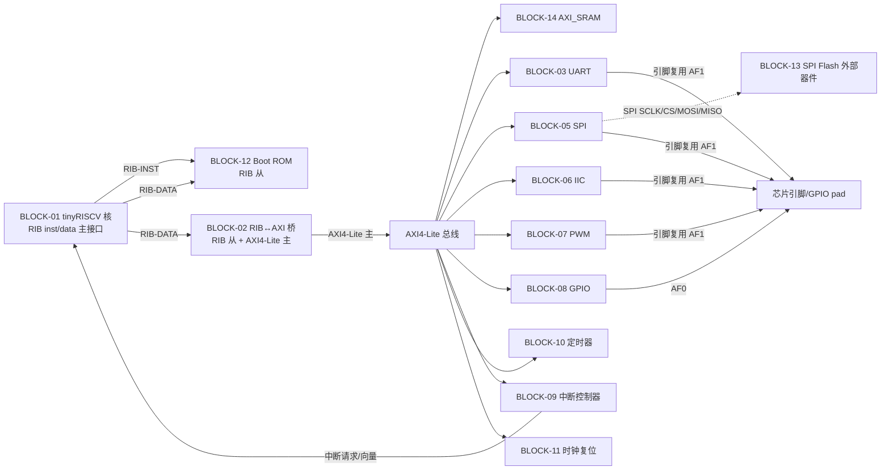

# 接口规格书 — tinyRISCV MCU 级 SoC

> 节点 A3 产物（接口规格）| 归属：spec-agent | 版本：v0.1（A3 草案，待 A5 规格评审冻结）
> 上位文档：`spec-001-PRD.md`（需求，20 REQ）、`spec-002-use-cases.md`（场景/用例，12 SC / 32 UC）、`spec-004-system-spec.md`（系统规格：BLOCK-01~14 / FS-001~020 / M-001~020）
> 本文档定义"SoC 对外长什么样"：四类接口（引脚 / 总线 / 中断 / 存储映射）+ 时钟/复位 + 寄存器接口初版。
> **数据源声明（单一事实源）**：`spec-005-pins.csv` / `spec-005-memory-map.csv` / `spec-005-irq.csv` 为机器可读单一数据源；本文档表格由数据源生成（人工同步），冲突/遗漏检查以脚本 `scripts/a3_check_interface.py` 输出为准。
> **不在本节点范围**：总线拓扑与互联选型（B3）、微架构级模块接口契约（C2）、内存映射细化（B2）。

## 1. 概述

### 1.1 目的与范围

- 冻结 SoC 全部外部与模块间接口：引脚、总线、中断、存储映射（四类），并给出时钟/复位接口与寄存器接口初版。
- 接口数据以 CSV 为单一数据源，供 C0 合同校验（`scripts/contract_check.py`）、B2 地址映射复用。
- 契约声明（沿袭 PRD）：tinyRISCV 核的 RIB 总线协议、核中断端口语义、JTAG 无标准 Debug Module 的影响均标注 **待 C0 合同验证 / B6 集成规划确认**，本节点不编造核侧细节；RIB↔AXI 桥为自研 SoC 级 IP（BLOCK-02），其 AXI 侧接口以本规格为输入，内部实现由 B/C 阶段定义。

### 1.2 编号引用纪律（ADR-008）

- 物理模块引用一律 `BLOCK-NN`（BLOCK-01~14，见 spec-004 §2.1）；需求引用 `REQ-NNN`；功能规格 `FS-NNN`；指标 `M-NNN`；用例 `UC-<功能域>-NNN`。
- 未决项 OI 格式 `OI-<节点ID>-<全局序号>`（本节点新增 OI-A3-006，序号全局递增接续 A2 之后，登记于 `spec-003-open-issues.md`）。
- 指标数字均为 spec-004 §3 M 表引用，不另立数值。

### 1.3 接口清单总览（Measure 度量）

| 接口类别 | 条目数 | 数据源 |
|---------|-------|--------|
| 引脚（芯片 pad） | 23（GPIO 16 + JTAG 5 + 时钟/复位 2） | spec-005-pins.csv |
| 总线接口 | 7（RIB 4 + AXI 3，见 §2） | 本文档 §2 |
| 中断源 | 10（外部 4 + 定时器 1 + 软件 1 + 外设 4） | spec-005-irq.csv |
| 存储映射（地址区） | 15（映射区 14 + 外部器件 1） | spec-005-memory-map.csv |
| 时钟/复位 | 2 引脚 + 1 时钟域 + 3 级复位层次 | 本文档 §5 |
| 寄存器接口初版 | 9 外设寄存器组（待 C1/C2 细化） | 本文档 §6 |

## 2. 总线接口

### 2.1 拓扑视图（Mermaid）

### 2.2 总线条目

| # | 总线条目 | 协议 | 主→从 | 地址/数据位宽 | ID 宽度 | 说明 / 带宽需求 |
|---|---------|------|-------|--------------|---------|----------------|
| 1 | RIB-INST | tinyRISCV RIB（私有，req/resp 通道；契约**待 C0 验证**） | BLOCK-01（主）→ BLOCK-12 / BLOCK-02（从） | 32 / 32 | — | 指令取指通道；复位后从 0x0000_0000 取指 |
| 2 | RIB-DATA | tinyRISCV RIB（同上） | BLOCK-01（主）→ BLOCK-12 / BLOCK-02（从） | 32 / 32 | — | 数据读写通道；地址 ≥ 0x2000_0000 转发桥 |
| 3 | RIB-SLV-BOOTROM | RIB（从） | BLOCK-12 | 32 / 32 | — | Boot ROM 从端口（MEM-01），RO |
| 4 | RIB-SLV-BRIDGE | RIB（从） | BLOCK-02 | 32 / 32 | — | 桥从端口；RIB 事务 → AXI 事务转换（REQ-018 / FS-016） |
| 5 | AXI-M-BRIDGE | AMBA AXI4-Lite（B3 裁定是否升级 AXI4 全量） | BLOCK-02（主）→ AXI 从设备 | 32 / 32 | 1（单 ID，桥后无并发主） | 桥 AXI 主端口；M-014 单次读时延 ≤ 10 周期 |
| 6 | AXI-S-SRAM | AXI4-Lite（从） | BLOCK-14 | 32 / 32 | 1 | AXI_SRAM 从端口（MEM-03）；固件加载目标 |
| 7 | AXI-S-PERIPH | AXI4-Lite（从） | BLOCK-03/05/06/07/08/09/10/11（9 个从端口） | 32 / 32 | 1 | 每外设 4KB 译码窗口（MEM-05~12）；寄存器访问 |

### 2.3 带宽需求（对照 M 指标）

| 接口 | 指标引用 | 需求 | 判定 |
|------|---------|------|------|
| AXI 总线（桥主） | M-014 | 单次读时延 ≤ 10 系统时钟周期；峰值 1 传输/周期 @50MHz（200 MB/s 读或写） | 外设寄存器访问远低于峰值，无瓶颈 |
| SPI 通道（SPI master ↔ 外部从设备/Flash） | M-006, M-007 | SCLK ≥ 12.5 MHz（Fsys/4 分频配置）；1KB 连续传输零错误 | SPI FIFO 填充带宽 12.5 Mbps ≪ AXI 能力 ✓ |
| UART 通道 | M-004, M-005 | 9600–921600 bps 可配；验收 115200 bps 双向连续 100KB 零丢失 | 中断/轮询双模式 + 收发 FIFO（初版 ≥16B，C1 细化）|
| IIC 通道 | M-008 | 标准 100 kbps / 快速 400 kbps | 低速外设，无 AXI 压力 ✓ |
| 固件启动加载（SPI Flash → AXI_SRAM） | M-013 | 复位释放 → 固件首指令 ≤ 5 ms（Flash 模型加载 64KB 镜像） | ⚠️ 单线 SPI 12.5MHz 读 64KB ≈ 41.9 ms > 5 ms，**见 OI-A3-006** |

## 3. 引脚规格（数据源：spec-005-pins.csv）

### 3.1 引脚分类

| 类别 | 信号 | 方向 | 数量 | 对应 BLOCK / REQ |
|------|------|------|------|-----------------|
| 时钟/复位 | clk_i, rst_n_i | in | 2 | BLOCK-11（REQ-010, FS-010） |
| JTAG | jtag_tck/tms/tdi/tdo/(trst_n 可选) | in/in/in/out/in | 5 | BLOCK-04（REQ-004, FS-004） |
| UART | uart_txd, uart_rxd（经 GPIO pad AF1 复用） | out/in | 2 | BLOCK-03（REQ-002, FS-002） |
| SPI | spi_sclk, spi_cs_n[1:0], spi_mosi, spi_miso（经 GPIO pad AF1 复用） | out/out/out/in | 5 | BLOCK-05（REQ-005, FS-005） |
| IIC | iic_scl, iic_sda（经 GPIO pad AF1 复用，开漏） | inout/inout | 2 | BLOCK-06（REQ-006, FS-006） |
| PWM | pwm_out[1:0]（经 GPIO pad AF1 复用） | out | 2 | BLOCK-07（REQ-007, FS-007） |
| GPIO | gpio[15:0] | inout | 16 | BLOCK-08（REQ-019/012, FS-012/017, M-020） |

### 3.2 引脚明细表

> 由 `spec-005-pins.csv` 生成。列：信号名 / 方向 / 位宽 / IO 电气属性（类型、驱动、上拉）/ 复位值 / 复位源 / 默认功能 / 复用功能 / 所属 BLOCK。

| 信号 | 方向 | 位宽 | IO 类型 | 驱动 | 上拉/下拉 | 复位值 | 复位源 | 默认功能 | 复用功能 | BLOCK | 说明 |
|------|------|------|---------|------|-----------|--------|--------|---------|---------|-------|------|
| clk_i | in | 1 | LVCMOS | — | — | 0 | POR | clk_i | — | BLOCK-11 | 外部时钟输入 10–50MHz，片上时钟管理生成 Fsys（FS-010, M-002） |
| rst_n_i | in | 1 | LVCMOS | — | 上拉 | 1 | POR | rst_n_i | — | BLOCK-11 | 外部复位，低有效；异步复位/同步释放（FS-010） |
| jtag_tck | in | 1 | LVCMOS | — | 下拉 | 0 | POR | jtag_tck | — | BLOCK-04 | IEEE 1149.1 TCK；异步域经同步器（C5 检查项） |
| jtag_tms | in | 1 | LVCMOS | — | 上拉 | 1 | POR | jtag_tms | — | BLOCK-04 | IEEE 1149.1 TMS |
| jtag_tdi | in | 1 | LVCMOS | — | 上拉 | 1 | POR | jtag_tdi | — | BLOCK-04 | IEEE 1149.1 TDI |
| jtag_tdo | out | 1 | LVCMOS | 4mA | — | hi-z | POR | jtag_tdo | — | BLOCK-04 | TDO；TAP 未使能时三态 |
| jtag_trst_n | in | 1 | LVCMOS | — | 上拉 | 1 | POR | jtag_trst_n | — | BLOCK-04 | 可选 TRST_N，低有效（IEEE 1149.1 可选） |
| gpio[0] | inout | 1 | LVCMOS | 可配 2/4/8mA | 上拉 | input | POR | gpio[0] | uart_txd | BLOCK-08 | AF0=GPIO0, AF1=UART_TXD |
| gpio[1] | inout | 1 | LVCMOS | 可配 2/4/8mA | 上拉 | input | POR | gpio[1] | uart_rxd | BLOCK-08 | AF0=GPIO1, AF1=UART_RXD |
| gpio[2] | inout | 1 | LVCMOS | 可配 2/4/8mA | 上拉 | input | POR | gpio[2] | spi_sclk | BLOCK-08 | AF0=GPIO2, AF1=SPI_SCLK |
| gpio[3] | inout | 1 | LVCMOS | 可配 2/4/8mA | 上拉 | input | POR | gpio[3] | spi_cs_n[0] | BLOCK-08 | AF0=GPIO3, AF1=SPI_CS_N[0]（SPI Flash CS） |
| gpio[4] | inout | 1 | LVCMOS | 可配 2/4/8mA | 上拉 | input | POR | gpio[4] | spi_cs_n[1] | BLOCK-08 | AF0=GPIO4, AF1=SPI_CS_N[1]（外部从设备） |
| gpio[5] | inout | 1 | LVCMOS | 可配 2/4/8mA | 上拉 | input | POR | gpio[5] | spi_mosi | BLOCK-08 | AF0=GPIO5, AF1=SPI_MOSI |
| gpio[6] | inout | 1 | LVCMOS | 可配 2/4/8mA | 上拉 | input | POR | gpio[6] | spi_miso | BLOCK-08 | AF0=GPIO6, AF1=SPI_MISO |
| gpio[7] | inout | 1 | LVCMOS | 可配 2/4/8mA | 上拉 | input | POR | gpio[7] | iic_scl | BLOCK-08 | AF0=GPIO7, AF1=IIC_SCL（开漏） |
| gpio[8] | inout | 1 | LVCMOS | 可配 2/4/8mA | 上拉 | input | POR | gpio[8] | iic_sda | BLOCK-08 | AF0=GPIO8, AF1=IIC_SDA（开漏） |
| gpio[9] | inout | 1 | LVCMOS | 可配 2/4/8mA | 上拉 | input | POR | gpio[9] | pwm_out[0] | BLOCK-08 | AF0=GPIO9, AF1=PWM0（M-009/010） |
| gpio[10] | inout | 1 | LVCMOS | 可配 2/4/8mA | 上拉 | input | POR | gpio[10] | pwm_out[1] | BLOCK-08 | AF0=GPIO10, AF1=PWM1 |
| gpio[11] | inout | 1 | LVCMOS | 可配 2/4/8mA | 上拉 | input | POR | gpio[11] | — | BLOCK-08 | 仅 GPIO |
| gpio[12] | inout | 1 | LVCMOS | 可配 2/4/8mA | 上拉 | input | POR | gpio[12] | — | BLOCK-08 | 仅 GPIO |
| gpio[13] | inout | 1 | LVCMOS | 可配 2/4/8mA | 上拉 | input | POR | gpio[13] | — | BLOCK-08 | 仅 GPIO |
| gpio[14] | inout | 1 | LVCMOS | 可配 2/4/8mA | 上拉 | input | POR | gpio[14] | — | BLOCK-08 | 仅 GPIO |
| gpio[15] | inout | 1 | LVCMOS | 可配 2/4/8mA | 上拉 | input | POR | gpio[15] | — | BLOCK-08 | 仅 GPIO |

> **电气属性口径**：工艺/库未定（OI-A1-004，ADR-002），IO 电平参考 LVCMOS 3.3V MCU 级；驱动/上下拉可配（GPIO），正式电气参数待工艺库确定后核定（E/F 阶段前）。复位值为 pad 级默认态（输入/高阻/上拉），外设功能输出由固件配置 PINMUX 后生效（REQ-012：无内部悬空、引脚复用可配置）。

### 3.3 引脚复用表（PINMUX，BLOCK-08）

| pad | AF0（默认） | AF1 |
|-----|------------|-----|
| gpio[0] | GPIO0 | UART_TXD |
| gpio[1] | GPIO1 | UART_RXD |
| gpio[2] | GPIO2 | SPI_SCLK |
| gpio[3] | GPIO3 | SPI_CS_N[0]（Flash） |
| gpio[4] | GPIO4 | SPI_CS_N[1]（外部从设备） |
| gpio[5] | GPIO5 | SPI_MOSI |
| gpio[6] | GPIO6 | SPI_MISO |
| gpio[7] | GPIO7 | IIC_SCL |
| gpio[8] | GPIO8 | IIC_SDA |
| gpio[9] | GPIO9 | PWM0 |
| gpio[10] | GPIO10 | PWM1 |
| gpio[11..15] | GPIO11..15 | — |

> 复用决策：SPI/IIC/PWM/UART 信号经 GPIO pad 复用引出（REQ-019），JTAG 与时钟/复位为专用 pad（调试与启动不可复用）。SPI Flash（BLOCK-13）外部连接 SPI_CS_N[0]/SCLK/MOSI/MISO 对应 pad。

## 4. 中断规格（数据源：spec-005-irq.csv）

### 4.1 中断源表

| 中断号 | 名称 | 源模块 | 触发方式 | 极性 | 可屏蔽 | 优先级 | 事件语义 | 覆盖用例 |
|--------|------|--------|---------|------|--------|--------|---------|---------|
| 1 | UART_RX | BLOCK-03 | level | high | 可屏蔽 | 1 | 接收完成/数据可用（FS-002） | UC-UART-002 |
| 2 | UART_TX | BLOCK-03 | level | high | 可屏蔽 | 2 | 发送缓冲空 | UC-UART-001 |
| 3 | SPI_DONE | BLOCK-05 | level | high | 可屏蔽 | 3 | 传输完成（含 SPI Flash 访问，FS-005） | UC-SPI-001/002 |
| 4 | IIC_DONE | BLOCK-06 | level | high | 可屏蔽 | 4 | 传输完成/NACK 错误回报（FS-006） | UC-IIC-001~003 |
| 5 | TIMER0 | BLOCK-10 | level | high | 可屏蔽 | 5 | 定时器周期中断（FS-009, M-012，周期误差 ±1 时钟） | UC-INT-002 |
| 6 | SW_INT | BLOCK-09 | level | high | 可屏蔽 | 6 | 软件中断，软件置位/清除（FS-008） | UC-INT-003 |
| 7 | GPIO_EXT0 | BLOCK-08 | edge | rise/fall 可配 | 可屏蔽 | 7 | GPIO[0:3] 事件→外部中断（FS-008/017） | UC-GPIO-002, UC-INT-001 |
| 8 | GPIO_EXT1 | BLOCK-08 | edge | rise/fall 可配 | 可屏蔽 | 8 | GPIO[4:7] 事件 | UC-GPIO-002 |
| 9 | GPIO_EXT2 | BLOCK-08 | edge | rise/fall 可配 | 可屏蔽 | 9 | GPIO[8:11] 事件 | UC-GPIO-002 |
| 10 | GPIO_EXT3 | BLOCK-08 | edge | rise/fall 可配 | 可屏蔽 | 10 | GPIO[12:15] 事件 | UC-GPIO-002 |

- 中断源合计 **10 路**：外部（GPIO_EXT）4 + 定时器 1 + 软件 1 + 外设 4 → 满足 **M-019（≥6：外部 ≥4 + 定时器 1 + 软件 1）**。
- 中断号 0 保留（无中断）；中断号唯一、1–10 连续分配。
- **优先级**：默认静态优先级 = 中断号（数值小者优先）；可编程优先级（4-bit/源，寄存器 INT_PRI）待 C1 细化。多中断并发按优先级有序响应、无丢失无死锁（UC-INT-004）、风暴可屏蔽恢复（UC-INT-005）。
- **与核的接口语义**：BLOCK-09 聚合 10 路源，向核输出中断请求 + 中断向量（每源对应 ISR 入口）；核侧中断端口名称/时序/向量机制依 tinyRISCV 契约，**待 C0 合同验证**（沿 PRD 契约声明，本节点不编造）。
- GPIO 中断仅在 pad 处于 AF0（GPIO）模式时有效；置 AF1（外设）后该 pad 不产生 GPIO 事件（BLOCK-08 引脚复用规则）。

## 5. 时钟/复位接口

### 5.1 时钟域

| 时钟 | 频率 | 来源 | 域 | 说明 |
|------|------|------|-----|------|
| Fsys（系统时钟） | 50 MHz（10–50 可配） | clk_i 经 BLOCK-11 时钟管理分频生成 | 单系统时钟域（同步设计） | FS-010, M-002；全系统唯一功能时钟域 |
| UART 波特率时钟 | 由 Fsys 分频 | BLOCK-03 | 同 Fsys 域 | M-004：9600–921600 bps 可配 |
| SPI SCLK | ≤ Fsys/4（12.5 MHz） | BLOCK-05 分频 | 同 Fsys 域（输出到外部） | M-006；SPI Flash 时钟由 SCLK 驱动（外部器件时钟） |
| IIC SCL | 100 / 400 kHz | BLOCK-06 分频 | 同 Fsys 域（开漏输出） | M-008 |
| PWM 计数时钟 | Fsys 分频 | BLOCK-07 | 同 Fsys 域 | M-009/010：1 kHz–1 MHz 输出 |
| JTAG TCK | 外部异步 | 外部输入 | 独立异步域 | 跨时钟域经同步器（C5 CDC 检查项，spec-004 §4.2） |

- **时钟使能（门控）**：BLOCK-11 提供每外设时钟使能（CLK_EN 寄存器），空闲模式门控降功耗（FS-013, M-017）；唤醒源：外部中断 / GPIO 事件 / UART 事件（M-018，唤醒时延 ≤ 10 μs）。

### 5.2 复位层次

| 层次 | 复位源 | 极性/方式 | 作用范围 | 说明 |
|------|--------|---------|---------|------|
| L1 全局复位 | POR（上电）+ rst_n_i（外部） | 低有效；**异步复位、同步释放**（FS-010） | 全系统 | 复位释放后进入已知启动状态（REQ-010, UC-BOOT-003） |
| L2 外设域软复位 | CLK_RST.SOFT_RST 寄存器 | 寄存器写 1 触发，自动清除 | 单个外设（BLOCK-03~10） | 外设故障恢复（如 UART 帧错误恢复，UC-UART-003） |
| L3 核复位 | 全局复位派生 | 与 L1 同步释放 | BLOCK-01 核 | 复位向量 0x0000_0000（Boot ROM） |

## 6. 寄存器接口初版（待 C1/C2 细化）

> 初版仅供接口冻结与后续细化基线：偏移/读写/复位值已定，**位域级细节标注"待 C1/C2 细化"**，不阻塞本节点冻结。寄存器空间经 AXI4-Lite 访问，每外设 4KB 窗口（基地址见 §7.2）。

### 6.1 UART（BLOCK-03，基址 0x4000_0000）

| 偏移 | 寄存器 | 读写 | 复位值 | 字段要点（待 C1/C2 细化） |
|------|--------|------|--------|--------------------------|
| 0x00 | CTRL | R/W | 0x0 | TX/RX 使能、波特率分频装载（FS-002, M-004） |
| 0x04 | BAUD | R/W | 0x0 | 波特率分频值（9600–921600） |
| 0x08 | TX_DATA | W | — | 发送数据（8N1） |
| 0x0C | RX_DATA | R | 0x0 | 接收数据（读清空/指针） |
| 0x10 | STATUS | R | 0x0 | TX_BUSY / RX_FULL / RX_EMPTY / FRAME_ERR / OVERRUN（帧错误检测，UC-UART-003） |
| 0x14 | INT_EN | R/W | 0x0 | RX/TX 中断使能（IRQ-01/02） |
| 0x18 | INT_STATUS | R/W1C | 0x0 | 中断状态与清除 |
| 0x1C | FIFO_CTRL | R/W | 0x0 | 收发 FIFO 深度/清空（初版 ≥16B，支撑 M-005 连续 100KB 零丢失） |

### 6.2 SPI（BLOCK-05，基址 0x4000_1000）

| 偏移 | 寄存器 | 读写 | 复位值 | 字段要点（待 C1/C2 细化） |
|------|--------|------|--------|--------------------------|
| 0x00 | CTRL | R/W | 0x0 | master 使能、CPOL/CPHA（四模式，FS-005）、SCLK 分频（Fsys/4 上限，M-006） |
| 0x04 | STATUS | R | 0x0 | BUSY / TX_EMPTY / RX_FULL |
| 0x08 | TX_DATA | W | — | 发送数据 |
| 0x0C | RX_DATA | R | 0x0 | 接收数据（1KB 零错误对拍，M-007） |
| 0x10 | CS_CTRL | R/W | 0x0 | CS 选择（cs_n[1:0]）/ 自动或手动拉低 |
| 0x14 | INT_EN / INT_STATUS | R/W / R/W1C | 0x0 | 传输完成中断（IRQ-03） |
| 0x18 | FLASH_CMD | R/W | 0x0 | SPI Flash 命令/地址/数据模式（固件读取与更新通道，REQ-003/011；bootloader 使用，待 C1 细化） |

### 6.3 IIC（BLOCK-06，基址 0x4000_2000）

| 偏移 | 寄存器 | 读写 | 复位值 | 字段要点（待 C1/C2 细化） |
|------|--------|------|--------|--------------------------|
| 0x00 | CTRL | R/W | 0x0 | 使能、模式（标准 100k / 快速 400k，M-008） |
| 0x04 | STATUS | R | 0x0 | BUSY / NACK / ARB_LOST（NACK 检测与终止，UC-IIC-002） |
| 0x08 | TX_DATA | W | — | 发送数据 |
| 0x0C | RX_DATA | R | 0x0 | 接收数据 |
| 0x10 | CMD | W | 0x0 | START/STOP/读写控制（多字节连续传输，UC-IIC-003） |
| 0x14 | TARGET_ADDR | R/W | 0x0 | 7-bit 从地址 |
| 0x18 | INT_EN / INT_STATUS | R/W / R/W1C | 0x0 | 完成/错误中断（IRQ-04） |

### 6.4 PWM（BLOCK-07，基址 0x4000_3000）

| 偏移 | 寄存器 | 读写 | 复位值 | 字段要点（待 C1/C2 细化） |
|------|--------|------|--------|--------------------------|
| 0x00 | CTRL | R/W | 0x0 | 使能、通道选择 |
| 0x04 | PERIOD | R/W | 0x0 | 周期计数值（1 kHz–1 MHz，M-010） |
| 0x08 | DUTY[0] | R/W | 0x0 | 通道 0 占空比（8 bit 分辨率 0–255，M-009） |
| 0x0C | DUTY[1] | R/W | 0x0 | 通道 1 占空比（0%/100% 边界恒低/恒高，UC-PWM-002） |

### 6.5 GPIO（BLOCK-08，基址 0x4000_4000）

| 偏移 | 寄存器 | 读写 | 复位值 | 字段要点（待 C1/C2 细化） |
|------|--------|------|--------|--------------------------|
| 0x00 | DATA_OUT | R/W | 0x0 | 输出数据（LED 驱动，UC-GPIO-001） |
| 0x04 | DATA_IN | R | 0x0 | 输入状态（UC-GPIO-002） |
| 0x08 | DIR | R/W | 0x0 | 方向（0=输入, 1=输出，复位默认输入） |
| 0x0C | PINMUX | R/W | 0x0 | 每 pad 2-bit AF 选择（AF0/AF1，§3.3 引脚复用表） |
| 0x10 | PAD_CFG | R/W | 0x0 | 驱动强度 2/4/8mA、上拉/下拉使能 |
| 0x14 | IRQ_EN | R/W | 0x0 | GPIO 事件中断使能（IRQ-07~10） |
| 0x18 | IRQ_STATUS | R/W1C | 0x0 | 中断状态与清除 |
| 0x1C | IRQ_TRIG | R/W | 0x0 | 触发配置：边沿（rise/fall/双沿）/电平、极性、分组（EXT0~3） |

### 6.6 中断控制器 INT（BLOCK-09，基址 0x4000_5000）

| 偏移 | 寄存器 | 读写 | 复位值 | 字段要点（待 C1/C2 细化） |
|------|--------|------|--------|--------------------------|
| 0x00 | INT_EN | R/W | 0x0 | 全局中断使能 |
| 0x04 | INT_MASK | R/W | 0x0 | 每源屏蔽（10 bit，对应 IRQ-01~10） |
| 0x08 | INT_PEND | R | 0x0 | 每源挂起状态 |
| 0x0C | INT_CLEAR | W1C | 0x0 | 每源清除（W1C） |
| 0x10 | INT_PRI[0..9] | R/W | 0x0 | 每源 4-bit 可编程优先级（默认=中断号） |
| 0x14 | VECTOR | R | 0x0 | 当前最高优先级挂起源对应向量号（核中断向量接口，待 C0 核对） |

### 6.7 定时器 TIMER（BLOCK-10，基址 0x4000_6000）

| 偏移 | 寄存器 | 读写 | 复位值 | 字段要点（待 C1/C2 细化） |
|------|--------|------|--------|--------------------------|
| 0x00 | CTRL | R/W | 0x0 | 使能、单次/周期模式 |
| 0x04 | LOAD | R/W | 0x0 | 周期装载值（周期误差 ±1 时钟，M-012） |
| 0x08 | COUNT | R | 0x0 | 当前计数值 |
| 0x0C | INT_STATUS | R/W1C | 0x0 | 定时器中断状态（IRQ-05） |

### 6.8 时钟复位 CLK_RST（BLOCK-11，基址 0x4000_7000）

| 偏移 | 寄存器 | 读写 | 复位值 | 字段要点（待 C1/C2 细化） |
|------|--------|------|--------|--------------------------|
| 0x00 | CLK_DIV | R/W | 0x0 | Fsys 分频配置（10–50 MHz，M-002） |
| 0x04 | CLK_EN | R/W | 0x0 | 每外设时钟使能/门控（FS-013, M-017；空闲模式降功耗） |
| 0x08 | SOFT_RST | R/W | 0x0 | 每外设软复位（L2 层次，§5.2） |
| 0x0C | RST_STATUS | R | 0x0 | 复位源状态（POR/外部） |

## 7. 存储映射（数据源：spec-005-memory-map.csv）

### 7.1 地址空间视图

| 地址范围 | 区域 | 大小 | 属性 | 归属 |
|----------|------|------|------|------|
| 0x0000_0000 – 0x0000_0FFF | Boot ROM | 4 KB | RO（取指/读） | BLOCK-12（RIB 侧） |
| 0x0000_1000 – 0x1FFF_FFFF | RIB 保留区 | ~512 MB | 保留（访问错误） | BLOCK-02 译码外 |
| 0x2000_0000 – 0x2000_FFFF | AXI_SRAM | 64 KB | R/W | BLOCK-14（经桥） |
| 0x2001_0000 – 0x3FFF_FFFF | AXI 保留区 | ~512 MB | 保留（访问错误） | BLOCK-02 译码外 |
| 0x4000_0000 – 0x4000_7FFF | 外设寄存器组（8 × 4KB） | 32 KB | R/W | BLOCK-03/05/06/07/08/09/10/11（经桥） |
| 0x4000_8000 – 0x4FFF_FFFF | 外设保留区 | ~255.5 MB | 保留（访问错误） | BLOCK-02 译码外 |
| 0x5000_0000 – 0xFFFF_FFFF | 未映射区 | 2.75 GB | 未映射（访问错误） | — |
| （外部器件） | SPI Flash | 视器件型号 | PIO 访问（无地址映射） | BLOCK-13 |

### 7.2 存储映射明细表（由 spec-005-memory-map.csv 生成）

| 区域 ID | 区域 | 名称 | 基地址 | 大小 | 数据位宽 | 访问 | BLOCK | 说明 |
|---------|------|------|--------|------|---------|------|-------|------|
| MEM-01 | RIB | Boot ROM | 0x0000_0000 | 0x1000（4KB） | 32 | RO | BLOCK-12 | 复位取指入口，含 bootloader 启动代码（FS-001）；若超 4KB 需 B2 量化调整 |
| MEM-02 | RIB | RIB 保留区 | 0x0000_1000 | 0x1FFF_F000 | 32 | — | BLOCK-02 | 保留地址空洞，访问返回总线错误 |
| MEM-03 | AXI | AXI_SRAM | 0x2000_0000 | 0x1_0000（64KB） | 32 | R/W | BLOCK-14 | 运行数据/固件加载目标（FS-011）；容量 B2 量化 |
| MEM-04 | AXI | AXI 保留区 | 0x2001_0000 | 0x1FFF_0000 | 32 | — | BLOCK-02 | 保留地址空洞，访问错误 |
| MEM-05 | AXI | UART | 0x4000_0000 | 0x1000（4KB） | 32 | R/W | BLOCK-03 | 寄存器空间（§6.1） |
| MEM-06 | AXI | SPI | 0x4000_1000 | 0x1000（4KB） | 32 | R/W | BLOCK-05 | 寄存器空间（§6.2）；SPI Flash PIO 访问通道 |
| MEM-07 | AXI | IIC | 0x4000_2000 | 0x1000（4KB） | 32 | R/W | BLOCK-06 | 寄存器空间（§6.3） |
| MEM-08 | AXI | PWM | 0x4000_3000 | 0x1000（4KB） | 32 | R/W | BLOCK-07 | 寄存器空间（§6.4） |
| MEM-09 | AXI | GPIO | 0x4000_4000 | 0x1000（4KB） | 32 | R/W | BLOCK-08 | 寄存器空间（§6.5） |
| MEM-10 | AXI | INT | 0x4000_5000 | 0x1000（4KB） | 32 | R/W | BLOCK-09 | 中断控制器寄存器（§6.6） |
| MEM-11 | AXI | TIMER | 0x4000_6000 | 0x1000（4KB） | 32 | R/W | BLOCK-10 | 定时器寄存器（§6.7） |
| MEM-12 | AXI | CLK_RST | 0x4000_7000 | 0x1000（4KB） | 32 | R/W | BLOCK-11 | 时钟分频/门控/软复位（§6.8） |
| MEM-13 | AXI | 外设保留区 | 0x4000_8000 | 0x0FFF_8000 | 32 | — | BLOCK-02 | 保留地址空洞，访问错误 |
| MEM-14 | — | SPI Flash（外部器件） | —（无地址映射） | — | 8 | PIO | BLOCK-13 | 固件非易失存储；经 SPI master（BLOCK-05）PIO 访问（FS-003/011, M-013） |
| MEM-15 | AXI | 未映射区 | 0x5000_0000 | 0xB000_0000 | 32 | — | BLOCK-02 | 未映射，访问错误 |

> **地址重叠检查**：全部 14 个地址映射区（MEM-01~13, 15）经 `scripts/a3_check_interface.py` 扫描，基址+大小无重叠、不越 32-bit 空间、无重复译码（脚本输出见自检报告）；MEM-14（SPI Flash）为外部器件 PIO 访问，无地址映射，不参与译码。
> **启动流**：复位取指 MEM-01（Boot ROM）→ bootloader 经 MEM-06（SPI）读 MEM-14（Flash）→ 固件加载至 MEM-03（AXI_SRAM，基址 0x2000_0000）→ 跳转执行（FS-001, UC-BOOT-004）。

## 8. 遗漏核对（UC → 接口映射）

> 下表为机器可读遗漏核对表（`scripts/a3_check_interface.py --spec` 校验全 32 UC 均已覆盖）。**覆盖全部 12 SC / 32 UC**。

| UC | 外部交互 / 依赖接口 | 接口定义（引脚 / 总线 / 中断 / 存储映射） |
|----|---------------------|------------------------------------------|
| UC-BOOT-001 | 固件加载通道（UART/JTAG）、Flash 读、SRAM 写 | PAD-03~07（JTAG）、PAD-08/09（UART）、PAD-10~14（SPI）；MEM-01/03/14；§2 总线 1–7 |
| UC-BOOT-002 | 加载失败重试、错误回报 | 同上 + MEM-02/04/13/15（错误返回路径）；SPI STATUS |
| UC-BOOT-003 | 上电复位启动 | PAD-01/02（clk/rst）；MEM-12（CLK_RST）；MEM-01（复位向量） |
| UC-BOOT-004 | SPI Flash 读、经桥写 SRAM、跳转 | PAD-10~14（SPI）；MEM-03/06/14；§2 总线 4–6（桥） |
| UC-UART-001 | UART 发送日志 | PAD-08（uart_txd）；MEM-05；IRQ-02（TX） |
| UC-UART-002 | UART 接收命令并响应 | PAD-09（uart_rxd）；MEM-05；IRQ-01（RX） |
| UC-UART-003 | 波特率不匹配、帧错误恢复 | PAD-09；MEM-05（STATUS.FRAME_ERR）；L2 软复位 |
| UC-UART-004 | UART 下载、Flash 写入 | PAD-08/09；MEM-05/06/14；IRQ-01 |
| UC-UART-005 | 断电中断恢复（Flash 掉电保持） | MEM-14（非易失）；PAD-02（复位）；MEM-12 |
| UC-UART-006 | 校验失败拒绝升级 | MEM-14（保留旧固件）；MEM-06 |
| UC-UART-007 | 写 Flash 掉电保持 | PAD-10~14（SPI）；MEM-14；MEM-06 |
| UC-JTAG-001 | openocd 读内存 | PAD-03~07（JTAG）；§5.1 JTAG TCK 异步域；经核访问 MEM |
| UC-JTAG-002 | openocd 写内存/寄存器 | PAD-03~07；同上 |
| UC-JTAG-003 | 连接失败诊断（IDCODE） | PAD-03~07；IDCODE 可读（FS-004, §4.5 标准） |
| UC-SPI-001 | SPI 写命令到从设备 | PAD-10~14（SPI）；MEM-06；IRQ-03 |
| UC-SPI-002 | SPI 读从设备数据 | PAD-10~14；MEM-06；IRQ-03 |
| UC-SPI-003 | CPOL/CPHA 配置错误恢复 | PAD-10~14；MEM-06（CTRL 四模式） |
| UC-IIC-001 | IIC 读写从设备寄存器 | PAD-15/16（iic_scl/sda）；MEM-07；IRQ-04 |
| UC-IIC-002 | NACK 检测与终止 | PAD-15/16；MEM-07（STATUS.NACK）；IRQ-04 |
| UC-IIC-003 | 多字节连续传输 | PAD-15/16；MEM-07（CMD/TARGET_ADDR）；IRQ-04 |
| UC-PWM-001 | 配置并输出 PWM | PAD-17/18（pwm_out）；MEM-08 |
| UC-PWM-002 | 0%/100% 占空比边界 | PAD-17/18；MEM-08（PERIOD/DUTY） |
| UC-INT-001 | 外部中断触发 ISR | IRQ-07~10（GPIO_EXT）；MEM-10（INT）；GPIO pad |
| UC-INT-002 | 定时器周期中断 | IRQ-05（TIMER0）；MEM-11 |
| UC-INT-003 | 软件中断触发 | IRQ-06（SW_INT）；MEM-10 |
| UC-INT-004 | 多中断并发与优先级 | IRQ-01~10 全量；MEM-10（INT_PRI）；§4.1 优先级规则 |
| UC-INT-005 | 中断风暴可屏蔽恢复 | IRQ-01~10；MEM-10（INT_MASK） |
| UC-PWR-001 | 空闲降功耗、事件唤醒 | MEM-12（CLK_EN 门控）；唤醒源 IRQ-01/07~10；PAD-01/02 |
| UC-BUS-001 | 核经桥访问 AXI 侧 | §2 总线 4–6（RIB↔AXI 桥）；MEM-03/05~12 |
| UC-GPIO-001 | GPIO 输出驱动 LED、引脚复用 | PAD-08~23（gpio[15:0]）；MEM-09（DATA_OUT/DIR/PINMUX） |
| UC-GPIO-002 | GPIO 输入触发外部中断 | PAD-08~23；MEM-09（IRQ_EN/IRQ_TRIG）；IRQ-07~10 |
| UC-DEMO-001 | LED+UART+SPI+IIC+PWM 联动 | PAD-08~23；PAD-08/09（UART）、PAD-10~14（SPI）、PAD-15/16（IIC）、PAD-17/18（PWM）；MEM-05~09 |

> 遗漏核对结论：32 UC 全部映射至对应引脚/总线/中断/存储映射接口，无遗漏（脚本校验，见自检报告）。

## 9. 未决项与待细化清单

### 9.1 OI（开放问题，ADR-008 全流程编号）

| OI | 问题 | 影响 | 建议方案（供人工裁定） | 状态 |
|----|------|------|----------------------|------|
| OI-A3-006 | **SPI Flash 启动加载带宽 vs M-013 启动时延矛盾**：M-006 限 SCLK ≤ 12.5 MHz（Fsys/4），单线 SPI 读 64KB 镜像需 ≈ 41.9 ms，而 M-013 要求固件首指令 ≤ 5 ms。 | M-006/M-013 两指标冲突；BOOT 通路带宽需求（§2.3）；BLOCK-05/13 | ① 放宽 M-013 目标；② 提高 SCLK 上限（如 Fsys/2）；③ SPI 双/四线模式或加 DMA；④ M-013 口径改为"Boot ROM 首指令"。建议由 B4 建模量化后裁定 | open（待人工/B4 裁定，不阻塞 A3 冻结） |

### 9.2 待细化清单（不阻塞冻结）

| 项 | 细化归属 | 说明 |
|----|---------|------|
| 外设寄存器位域级定义 | C1 微架构 / C2 模块接口契约 | §6 初版已冻结偏移/读写/复位值，位域细节留 C1/C2 |
| GPIO 中断分组映射与边沿配置细节 | C1（BLOCK-08） | IRQ_TRIG 字段级定义 |
| 中断向量机制与核侧端口语义 | C0 合同验证 | tinyRISCV 中断契约，沿 PRD 契约声明 |
| RIB 总线 req/resp 时序契约 | C0 合同验证 | tinyRISCV RIB 私有协议细节 |
| JTAG 无标准 Debug Module 的访问机制 | C0 评估 | 影响 openocd 内存访问方案（REQ-004） |
| AXI 选型（AXI4-Lite vs AXI4 全量） | B3 总线选型 | 本规格以 AXI4-Lite 为基线 |
| 地址映射细化（Boot ROM 容量、AXI_SRAM 容量） | B2 地址映射 | 64KB SRAM 支撑 M-013 镜像；Boot ROM 4KB 若超需调整 |
| IO 电气参数（工艺库相关） | E/F 阶段前 | ADR-002 工艺未定，LVCMOS 3.3V 为参考 |

## 10. DoD 自检与度量

| 判据（DoD） | 度量 | 结论 |
|-------------|------|------|
| 四类接口清单齐备（引脚/总线/中断/存储映射）+ 时钟复位 + 寄存器初版 | 引脚 23 / 总线 7 / 中断 10 / 存储 15（映射 14 + 外部 1）/ 时钟复位 2 / 寄存器 9 组 | ✅ |
| 冲突扫描零结果（地址重叠 / 中断号重复 / 引脚重名 / 位宽不一致 / 引用未定义） | `a3_check_interface.py` 输出全零 | ✅（见自检报告） |
| 无遗漏：每个 UC 外部交互均有接口定义 | 32/32 UC 覆盖（§8） | ✅ |
| 唯一性：引脚名唯一、地址无重叠、中断号唯一、位宽一致 | 脚本逐项校验 | ✅ |
| 冻结基线（git commit + tag） | 待人工批准（详章 §5：冻结动作需人工批准） | ⏸ 待 A5 评审签字后执行 |

> 指标接口对应（M 表唯一事实源）：M-004/005（UART §3/§6.1）、M-006/007（SPI §3/§6.2）、M-008（IIC §3/§6.3）、M-009/010（PWM §3/§6.4）、M-011/019（中断 §4）、M-012（定时器 §4/§6.7）、M-013（启动通路 §2.3/§7.2，含 OI-A3-006）、M-014（AXI §2.2）、M-016/017/018（CLK_RST §5.1/§6.8）、M-020（GPIO §3.1）。

## 11. 变更记录

| 版本 | 日期 | 变更 | 作者 |
|------|------|------|------|
| v0.1 | 2026-08-20 | 初稿：四类接口 + 时钟复位 + 寄存器初版；CSV 数据源 3 件；校验脚本 a3_check_interface.py；OI-A3-006 | spec-agent |